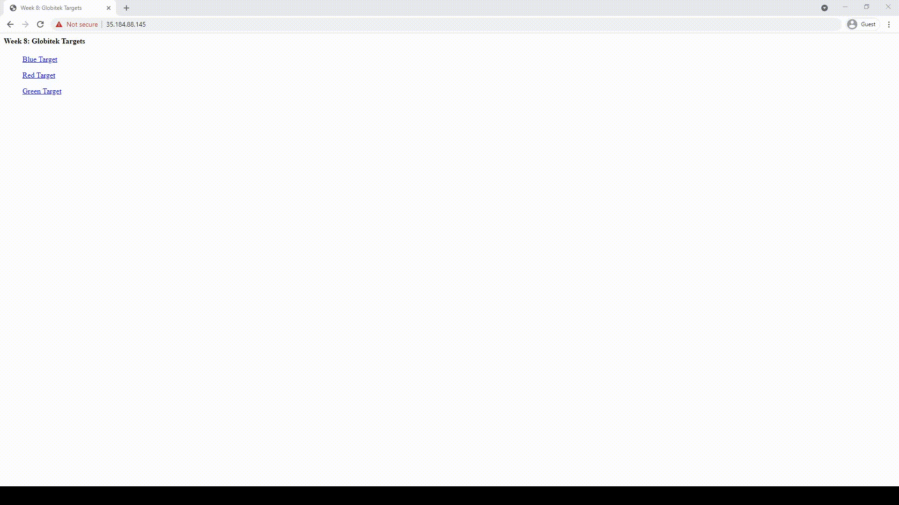
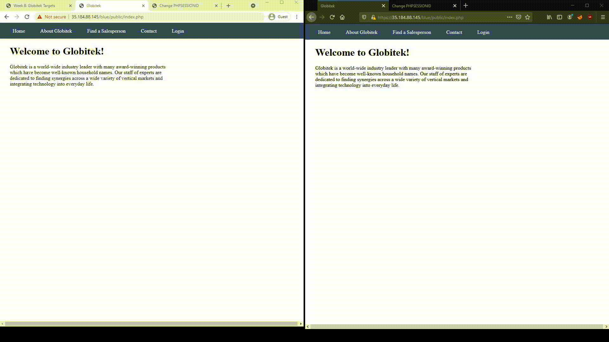
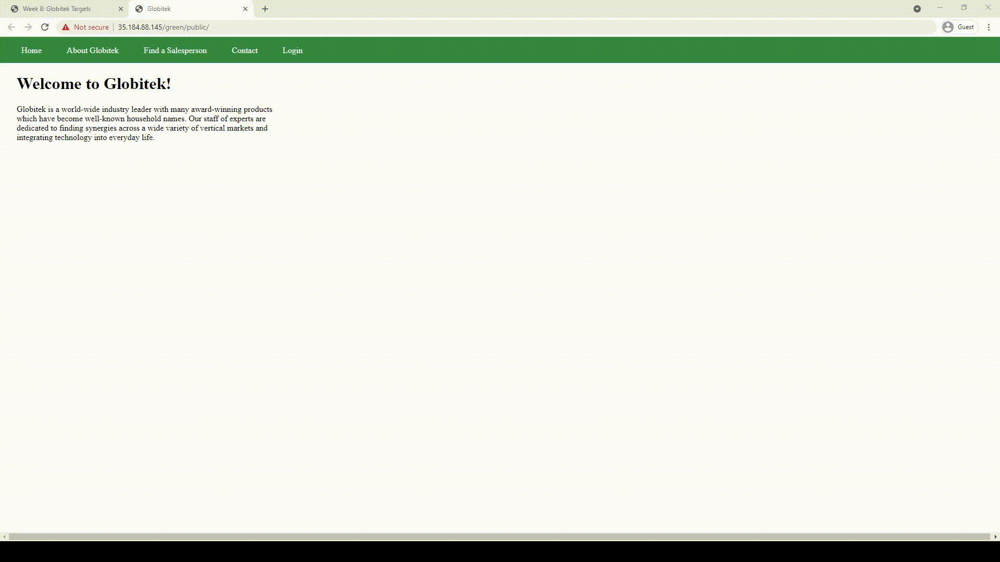

# Project 8 - Pentesting Live Targets

Time spent: **4** hours spent in total

> Objective: Identify vulnerabilities in three different versions of the Globitek website: blue, green, and red.

The six possible exploits are:

* Username Enumeration
* Insecure Direct Object Reference (IDOR)
* SQL Injection (SQLi)
* Cross-Site Scripting (XSS)
* Cross-Site Request Forgery (CSRF)
* Session Hijacking/Fixation

Each color is vulnerable to only 2 of the 6 possible exploits. First discover which color has the specific vulnerability, then write a short description of how to exploit it, and finally demonstrate it using screenshots compiled into a GIF.

## Blue

Vulnerability #1: SQL Injection (SQLi)

Description: Proved that database could be accessed

Vulnerability #2: Session Hijacking/Fixation

Description: Logined from different location after using the same sessionID

## Green

Vulnerability #1: Cross-Site Scripting (XSS)

Description: Caused an alert through XSS

Vulnerability #2: Username Enumeration

Description: The bolded login and unbolded login are visible differences for usernames that are in the database

## Red

Vulnerability #1: Insecure Direct Object Reference (IDOR)

Description: Accessed unreleased Object

Vulnerability #2: Cross-Site Request Forgery (CSRF)

Description: Changed information and csrf token

## Notes

Describe any challenges encountered while doing the work
